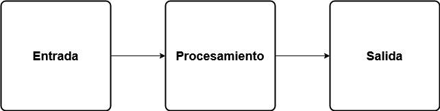
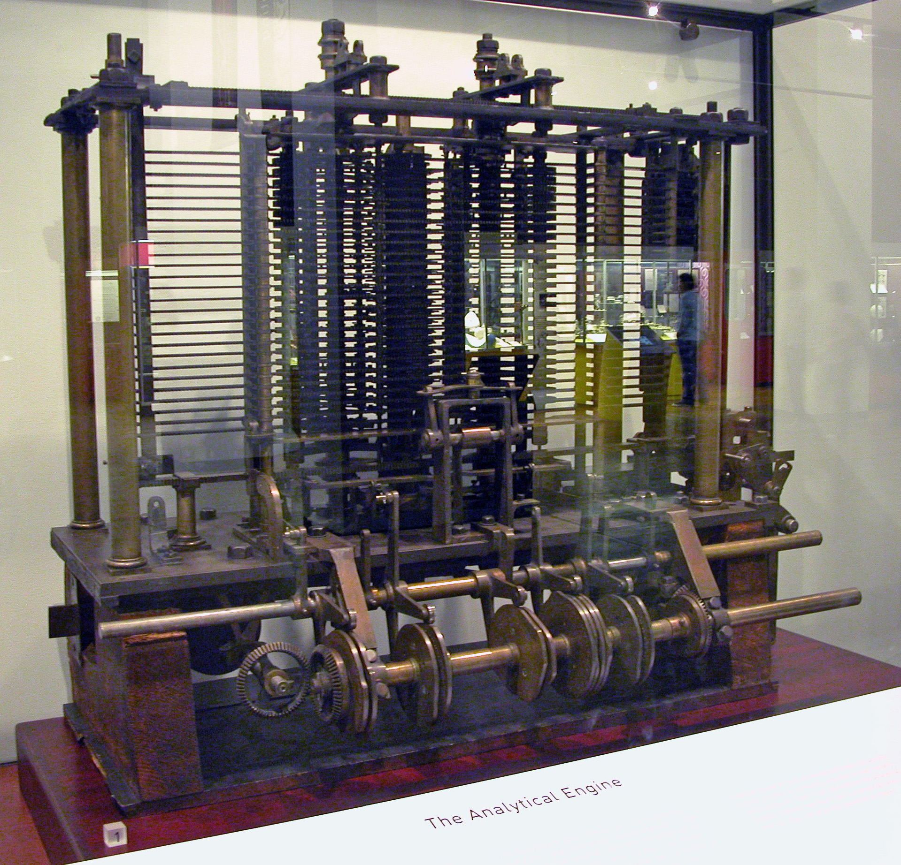
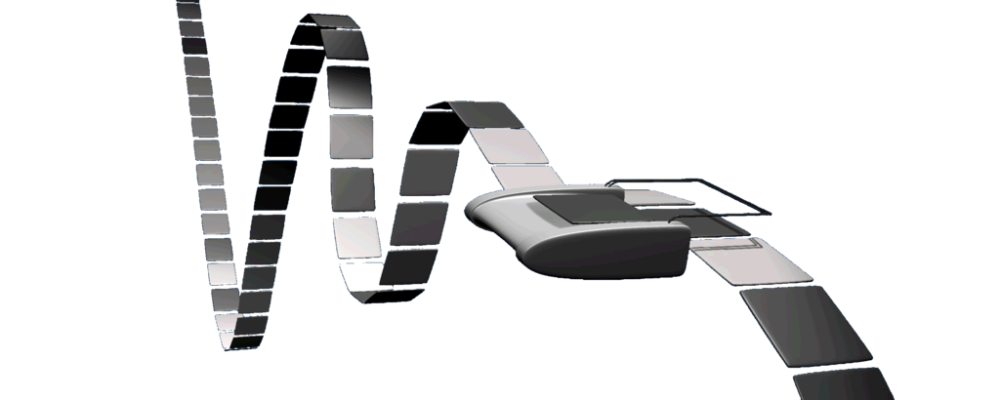
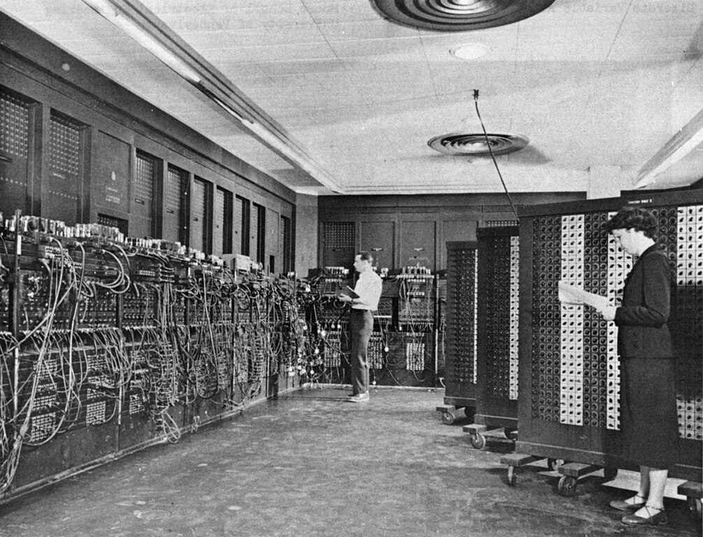
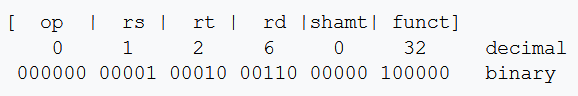

# Introducción a la programación de computadoras

## Trabajo previo

### Lecturas y videos

CS50 (Director). (2024). CS50x 2024—Lecture 0—Scratch. [https://www.youtube.com/watch?v=3LPJfIKxwWc](https://www.youtube.com/watch?v=3LPJfIKxwWc)
\
\
Wing, J. M. (2006). Computational thinking. *Communications of the ACM, 49*(3), 33-35. [https://dl.acm.org/doi/10.1145/1118178.1118215](https://dl.acm.org/doi/10.1145%2F1118178.1118215)

## Introducción

Una computadora es una máquina que ejecuta secuencias de instrucciones. Estas secuencias se denominan programas. La capacidad que tienen las computadoras de ser programadas permite modificar su funcionamiento sin necesidad de alterar sus componentes físicos, por lo que pueden ayudar a resolver una gran cantidad de problemas. Como paso previo a la elaboración de un programa, se acostumbra especificar la secuencia de pasos que lo componen en un algoritmo, el cual se expresa en lenguaje natural o en un diagrama. Los algoritmos y los programas reciben datos de entrada, los procesan y generan salidas. 

Las computadoras modernas están construídas con base en circuitos integrados, también llamados *chips* o *microchips*. Los circuitos integrados procesan información digital (que usa valores discretos), la cual generalmente es binaria (i.e. de dos valores). Los circuitos integrados de una computadora procesan dos estados correspondientes a dos niveles de tensión eléctrica: alto y bajo. Estos estados se representan con 0 y 1. Esto facilita la aplicación de la teoría de la información y del álgebra *booleana*.

Durante el período entre las guerras mundiales, Allan Turing desarrolló la máquina de Turing, un dispositivo teórico que manipula símbolos de una cinta de acuerdo con una tabla de reglas. La máquina de Turing simula el funcionamiento de un algoritmo y los conceptos de entrada, procesamiento y salida. En 1945, John von Neumann propuso un concepto conocido como programa almacenado, en el cual los datos y los programas se almacenan en una estructura llamada memoria, separada del hardware que ejecuta las instrucciones. Este esquema permite que las computadoras sean más fáciles de reprogramar y es conocido actualmente como arquitectura de von Neumann. Sus componentes principales son la memoria principal, la unidad central de procesamiento (CPU) y los sistemas de entrada y salida.

El código máquina es un conjunto de instrucciones binarias interpretables por la CPU de una computadora. Un programa consiste de una secuencia de instrucciones en código máquina. Debido a que programar una computadora de esta manera es muy lento y complicado, en la década de 1950 comenzaron a crearse lenguajes de programación los cuales, en lugar de unos y ceros, consisten de instrucciones formadas por palabras, usualmente en idioma inglés. Existe una gran variedad de lenguajes de programación que han sido creados con diversos fines: científicos, comerciales, educacionales, etc.

## Computadoras, algoritmos y programas

### Capacidades de las computadoras

Una computadora es una máquina que ejecuta secuencias de instrucciones. Estas secuencias se denominan programas. Las instrucciones de los programas realizan diversos tipos de operaciones entre los que pueden mencionarse:

- **Cálculos aritméticos**: sumar, restar, multiplicar, dividir.
- **Procesamiento de texto**: buscar, reemplazar, dividir y concatenar cadenas de texto.
- **Operaciones lógicas**: determinar si un número es mayor que otro, si una hilera está contenida en otra hilera o si un elemento está en una lista.
- **Manipulación de datos**: crear, leer, actualizar y eliminar datos en estructuras de datos (ej. listas, vectores, matrices) o en bases de datos.
- **Interacciones con el usuario**: recibir entradas del usuario (ej. del teclado o del ratón) y mostrarle información (ej. en la pantalla o en la impresora).
- **Manejo de archivos**: leer, escribir y modificar archivos.
- **Comunicaciones en red**: enviar y recibir datos a través de una red local o de la Internet (ej. páginas web, corres electrónicos).

La capacidad que tienen las computadoras de ser programadas, permite que su funcionamiento sea modificado sin necesidad de alterar sus componentes físicos, lo que las hace muy versátiles y aptas para ayudar a resolver una gran variedad de problemas, por lo que se dice que son de propósito general. Estas características las diferencian de otros tipos de máquinas, las cuales han sido construídas con fines específicos.

### Algoritmos

Para que una computadora sea útil en la solución de un problema, es necesario expresarlo mediante un conjunto de pasos claramente definidos. A estos conjuntos de pasos se les conoce como [algoritmos](https://es.wikipedia.org/wiki/Algoritmo). Más detalladamente, un algoritmo es un conjunto de instrucciones o reglas definidas y no ambiguas, ordenadas y finitas que permite solucionar un problema. Los algoritmos son fundamentales en ciencias de la computación, ya que son la base sobre la que se construyen los programas.

Un algoritmo puede ser tan sencillo como una [receta de cocina](https://cookpad.com/cr/recetas/6014919-arroz-con-pollo-al-estilo-costarricense) o tan complejo como los que se utilizan en [aprendizaje automático](https://link.springer.com/article/10.1023/A%3A1010933404324) (*machine learning*).

Un algoritmo debe cumplir con ciertas características básicas:

1. **Recibir entradas**: datos con los que trabaja.
2. **Generar salidas**: resultados generados por las operaciones que ejecuta el algoritmo.
3. **Cada paso debe ser claro**: la definición de cada paso debe ser precisa y sin ambigüedades.
4. **Debe ser finito**: debe terminar después de un número finito de pasos.

Hay varias formas de representar un algoritmo, entre las que están el [pseudocódigo](https://es.wikipedia.org/wiki/Pseudoc%C3%B3digo), un [diagrama de flujo](https://es.wikipedia.org/wiki/Diagrama_de_flujo) o simplemente una descripción escrita. A manera de ejemplo, se presenta seguidamente la descripción de un algoritmo para obtener el valor máximo de una lista:

```
Algoritmo para obtener el valor máximo de una lista
---------------------------------------------------

1. Lea la lista (del teclado, de un archivo o de alguna otra fuente).
2. Si la lista está vacía, despliegue la hilera de texto "Lista vacía" 
   y concluya el algoritmo. Si no, continúe con el paso 3.
3. Designe el primer elemento de la lista como "máximo actual".
4. Recorra la lista y compare cada uno de los elementos con el máximo actual.
   4.1. Si un elemento comparado es mayor que el máximo actual, 
        entonces desígnelo como el nuevo máximo actual.
5. Al finalizar el recorrido de la lista, imprima el máximo actual
   como valor máximo de la lista.
```

Seguidamente, se muestra la aplicación de este algoritmo a una lista de ejemplo.

1. Lista leída: **[29.6, -36.81, 31.85, 25.71, 90.2, 0.4]**
2. La lista no está vacía, por lo que se continúa con el paso 3.
3. Se designa al primer elemento de la lista, **29.6**, como el máximo actual.

4. Se recorre la lista y se compara cada uno de los elementos con el máximo actual.  
    4.1. Si un elemento comparado es mayor que el máximo actual, entonces pasa a ser el nuevo máximo actual.

**Elemento en negrita** = máximo actual  
*Elemento en itálica*  = elemento que está siendo comparado

[**29.6**, *-36.81*, 31.85, 25.71, 90.2, 0.4]

[**29.6**, -36.81, *31.85*, 25.71, 90.2, 0.4]

[29.6, -36.81, **31.85**, *25.71*, 90.2, 0.4]

[29.6, -36.81, **31.85**, 25.71, *90.2*, 0.4]

[29.6, -36.81, 31.85, 25.71, **90.2**, *0.4*]

[29.6, -36.81, 31.85, 25.71, **90.2**, 0.4]

5. Al finalizar el recorrido de la lista, se imprime el máximo actual como valor máximo de la lista: **90.2**

Note que el algoritmo tiene claramente definido un inicio (la lectura de la lista) y establace cual es la condición que debe cumplirse para su finalización (que termine el recorrido de la lista). Asimismo, cada uno de los pasos intermedios está especificado con claridad, incluyendo las condiciones para que se ejecuten.

Note además que el algoritmo incluye:

- **Lectura de entradas**: la lista.  
- **Procesamiento de las entradas**: recorrido de la lista y comparaciones entre sus elementos.  
- **Generación de salidas**: el valor máximo de la lista.  

### El modelo Entrada - Procesamiento - Salida

El modelo [*Entrada - Procesamiento - Salida*](https://en.wikipedia.org/wiki/IPO_model) (*Input - Process - Output* o IPO) describe la estructura básica de un algoritmo o de un programa de cómputo. Es un concepto fundamental en computación que describe el flujo de trabajo básico que emplean los sistemas para procesar información o datos. De acuerdo con este modelo, un algoritmo o programa recibe entradas (ej. números), las procesa (realiza cálculos matemáticos) y genera salidas (resultados de los cálculos). 

El modelo *Entrada - Procesamiento - Salida* se esquematiza en la figura 1.

<figure style="text-align: center;">
  
  <figcaption><strong>Figura 1</strong>. Modelo <em>Entrada - Procesamiento - Salida</em>.</figcaption>
</figure>

A continuación se describen los componentes del modelo:

- **Entrada (*Input*)**: consiste de datos o información que recibe el sistema. Pueden venir en diversas formas, como señales electrónicas, datos tecleados por un usuario o archivos, entre otros. La calidad y precisión de la entrada pueden afectar significativamente el resultado final del proceso.
- **Procesamiento (*Process*)**: Una vez que los datos de entrada son recibidos, el sistema los procesa de acuerdo con un conjunto de instrucciones o pasos. El procesamiento puede involucrar operaciones como cálculos matemáticos, operaciones lógicas, transformaciones o cualquier otra acción necesaria para generar la salida que se requiere. En este componente es usualmente donde se realiza el "trabajo" principal del sistema.
- **Salida (*Output*)**: Una vez finalizado el procesamiento, el sistema genera una salida. La salida es el resultado del proceso y puede presentarse en varias formas, como una visualización en pantalla, un archivo o un documento impreso, entre otras posibilidades. La salida puede ser el final del algoritmo o programa o puede servir como entrada para otro algoritmo o programa.

Para ilustrar el modelo *Entrada - Procesamiento - Salida*, se muestra su aplicación al cálculo del [índice de masa corporal (IMC)](https://es.wikipedia.org/wiki/%C3%8Dndice_de_masa_corporal), una razón matemática que clasifica el peso de las personas en categorías como bajo, normal y sobrepeso, con base en su masa y su estatura. El IMC necesita dos entradas: masa (en kilogramos) y estatura (en metros). El procesamiento se realiza mediante la fórmula: imc = masa/estatura<sup>2</sup>.

Entonces, un posible algoritmo para calcular el IMC de una persona es:

1. Lea la masa y la estatura de la persona.
2. Calcule el imc mediante la fórmula: imc = masa/estatura<sup>2</sup>.
3. Imprima el imc.

**Ejercicios**  
Calcule manualmente su IMC y verifique el resultado con esta [calculadora de IMC](https://www.nhlbi.nih.gov/health/educational/lose_wt/BMI/bmi-m_sp.htm).

### Implementación de algoritmos en programas

El diseño de un algoritmo puede verse como un paso previo a la elaboración de un programa de cómputo. Un mismo algoritmo puede implementarse en diferentes lenguajes de programación. Seguidamente se presenta la implementación del algoritmo de obtención del valor máximo de una lista en los lenguajes de programación [Python](https://es.wikipedia.org/wiki/Python) y [R](https://es.wikipedia.org/wiki/R_(lenguaje_de_programaci%C3%B3n)).

```python
# Python
# Obtención del valor máximo de una lista

# Entrada
lista = [29.6, -36.81, 31.85, 25.71, 90.2, 0.4]
print("Lista de entrada: ", lista)

# Procesamiento
if (len(lista) == 0):
    print("La lista está vacía")
else:
    max = lista[0]
    i = 0
    while (i < len(lista)):
        if (lista[i] > max):
            max = lista[i]
        i = i + 1
        
    # Salida
    print("Valor máximo de la lista:", max) 
```

```r
# R
# Obtención del valor máximo de una lista

# Entrada
lista <- c(29.6, -36.81, 31.85, 25.71, 90.2, 0.4)
cat("Lista de entrada: ", lista, "\n")

# Procesamiento
if (length(lista) == 0) {
  cat("La lista está vacía", "\n")
} else {
  max <- lista[1]
  i <- 1
  while (i <= length(lista)) {
    if (lista[i] > max) {
      max <- lista[i]
    }
    i <- i + 1
  }
  
  # Salida
  cat("Valor máximo de la lista: ", max, "\n")
}
```

**Ejercicios**  

1. Ejecute los programas anteriores en R y Python en los siguientes ambientes de ejecución en línea. Solamente debe copiar cada programa en el espacio destinado para ese fin y presionar el botón *Run* (ejecutar, correr).
    - [Ambiente de ejecución en línea para Python](https://www.mycompiler.io/new/python)
    - [Ambiente de ejecución en línea para R](https://www.mycompiler.io/new/r)
2. Con base en la descripción del IMC brindada en la sección anterior, elabore una hoja electrónica que calcule el IMC para 10 personas. Considere como incluir los componentes de entrada, procesamiento y salida.
3. Con base en el algoritmo descrito en la sección para el cálculo del IMC, elabore un programa en Python y otro programa en R que calculen el IMC de una persona.

## Arquitectura de computadoras

En esta sección, se explican los principales componentes de las computadoras modernas. Se realiza un recorrido por algunos de los principales antecedentes históricos de su evolución y se detallan los componentes de la arquitectura de von Neumann, el modelo de arquitectura más utilizado en la actualidad.

### Evolución histórica

#### Calculadoras mecánicas

Durante el siglo XVII, varios matemáticos construyeron calculadoras mecánicas capaces de realizar operaciones aritméticas. 

Alrededor de 1645, el filósofo y matemático francés [Blaise Pascal](https://es.wikipedia.org/wiki/Blaise_Pascal) (1623-1662) inventó la [Pascalina](https://es.wikipedia.org/wiki/Pascalina), una calculadora compuesta por ruedas y engranajes que podía sumar y restar. Pascal la creó con el propósito de ayudar a su padre, quien era contador en la Hacienda francesa y necesitaba una herramienta para realizar cálculos de aritmética comercial de manera más eficiente. La Pascalina podía sumar hasta tres partes en una sola operación, llegando al valor de 999 999 como máximo.

En 1672, el científico alemán [Gottfried Leibniz](https://es.wikipedia.org/wiki/Gottfried_Leibniz) (1646 - 1716) extendió las ideas de Pascal e introdujo la [*Stepped Reckoner* o máquina de Leibniz](https://en.wikipedia.org/wiki/Stepped_reckoner), un dispositivo que, además de sumar y restar, podía multiplicar, dividir y calcular raíces cuadradas. La máquina de Leibniz estaba basada en un dispositivo llamado [rueda de Leibniz](https://es.wikipedia.org/wiki/Rueda_de_Leibniz), un tambor con forma de cilindro, con un conjunto de dientes de longitud incremental a la que se le acopla una rueda de conteo. La figura 2 muestra una réplica de la máquina de Leibniz.

<figure style="text-align: center;">
  
  <figcaption><strong>Figura 2</strong>. Réplica de la máquina de Leibniz. Fuente: <a href="https://commons.wikimedia.org/wiki/User:Kolossos">Kolossos</a> a través de <a href="https://commons.wikimedia.org/wiki/File:Leibnitzrechenmaschine.jpg">Wikimedia Commons</a>.</figcaption>
</figure>

El objetivo de Leibniz era realizar cálculos de una manera "fácil, rápida y fiable". También pretendía que los números calculados pudieran ser tan grandes como se deseara, si el tamaño de la máquina era ajustado. Sin embargo, las primeras versiones de la rueda de Leibniz no eran fiables debido a que tenían piezas mecánicas que tendían a trabarse y a fallar.

Los derivados de las calculadoras mecánicas creadas por Pascal y Leibniz continuaron siendo producidos durante tres siglos, hasta que a principios de los años 1970 sus equivalentes electrónicos finalmente llegaron a ser fácilmente disponibles y baratos. 

#### La máquina analítica de Babbage

En la primera mitad del siglo XIX, el matemático inglés [Charles Babbage](https://es.wikipedia.org/wiki/Charles_Babbage) (1791 - 1871) diseñó la [máquina analítica](https://es.wikipedia.org/wiki/M%C3%A1quina_anal%C3%ADtica), una computadora mecánica que incorporaba algunas características de las computadoras modernas. Fue inicialmente descrita en 1837, aunque Babbage continuó refinando el diseño hasta su muerte en 1871. Es considerada la primera computadora programable de la historia. La máquina analítica de Babbage se muestra en la figura 3.

<figure style="text-align: center;">
  
  <figcaption><strong>Figura 3</strong>. Máquina analítica de Babbage. Fuente: Bruno Barral a través de <a href="https://commons.wikimedia.org/wiki/File:AnalyticalMachine_Babbage_London.jpg">Wikimedia Commons</a>.</figcaption>
</figure>

Aunque nunca fue terminada debido a limitaciones técnicas y económicas, su diseño revolucionario permitía realizar cálculos complejos y programarla para diversas tareas. Utilizaba tarjetas perforadas para la entrada de datos, disponía de una unidad aritmética para realizar operaciones matemáticas y una memoria capaz de almacenar hasta 1000 números. El lenguaje de programación que sería utilizado era similar a los actuales [lenguajes ensambladores](https://es.wikipedia.org/wiki/Lenguaje_ensamblador). Era posible implementar ciclos y condicionales de manera que el lenguaje propuesto habría sido [Turing-completo](https://es.wikipedia.org/wiki/Turing_completo). 

En 1843, la matemática británica [Ada Lovelace](https://es.wikipedia.org/wiki/Ada_Lovelace) (1815 - 1852) tradujo al inglés una descripción de la máquina analítica escrita en francés un año antes por el matemático italiano [Luigi Menabrea](https://es.wikipedia.org/wiki/Luigi_Menabrea) (1809 - 1896). Entre las notas que acompañan la traducción, Lovelace incluyó el detalle de los pasos mediante los cuales la máquina podría calcular los [números de Bernoulli](https://es.wikipedia.org/wiki/N%C3%BAmero_de_Bernoulli), lo que se considera por algunos el primer programa de computadoras de la historia. El diagrama correspondiente a este algoritmo/programa se muestra en la figura 4.

<figure style="text-align: center;">
  
  <figcaption><strong>Figura 4</strong>. Diagrama de un algoritmo para el cálculo de los números de Bernoulli en la máquina analítica de Babbage. Fuente: Ada Lovelace a través de <a href="https://commons.wikimedia.org/wiki/File:Diagram_for_the_computation_of_Bernoulli_numbers.jpg">Wikimedia Commons</a>.</figcaption>
</figure>

Ahora se cree que el autor de este programa fue probablemente el mismo Charles Babbage, que ya había desarrollado trabajos similares entre seis y siete años antes de la publicación del artículo de Lovelace. 

El aporte de Ada Lovelace fue de suma importancia para la computación, ya que fue la primera en reconocer la capacidad de las máquinas para ir más allá de los simples cálculos de números. Acertadamente, anticipó que en el futuro podrían hacer muchas otras cosas, como componer música o generar gráficos. En sus notas, Lovelace enfatizó la diferencia entre la máquina analítica y las máquinas de cálculo previas, en particular su capacidad de ser programada para resolver problemas de mayor complejidad.

#### La máquina de Turing

En 1936, el matemático británico [Allan Turing](https://es.wikipedia.org/wiki/Alan_Turing) (1912 - 1954) propuso la [máquina de Turing](https://es.wikipedia.org/wiki/M%C3%A1quina_de_Turing), un modelo matemático que manipula símbolos en una cinta según un conjunto de reglas. La figura 5 muestra una representación artística de la máquina de Turing.

<figure style="text-align: center;">
  
  <figcaption><strong>Figura 5</strong>. Representación artística de la máquina de Turing. Fuente: <a href="https://commons.wikimedia.org/wiki/User:Porao">Porao</a> a través de <a href="https://commons.wikimedia.org/wiki/File:Turing_Machine.png">Wikimedia Commons</a>.</figcaption>
</figure>

Una máquina de Turing está compuesta por:

1. **Una cinta**: actúa como memoria de la máquina. Se compone de celdas, cada una de las cuales puede contener un símbolo (ej. una letra, un número).
2. **Una cabeza lectora/escritora**: lee y escribe símbolos en la cinta.
3. **Un conjunto de estados**: entre los cuales la máquina puede cambiar en respuesta a lo que lee en la cinta. Hay un estado inicial desde el cual el funcionamiento de la máquina comienza, y uno o más estados de parada que indican que la máquina ha terminado su computación.
4. **Una tabla de acciones**: indica para combinación de estado actual y símbolo leído en la cinta, qué acción debe realizar la máquina. Estas acciones incluyen leer o escribir un símbolo en la cinta, mover la cabeza lectora/escritora a la izquierda o a la derecha sobre la cinta y cambiar a un nuevo estado.

Con este esquema, una máquina de Turing puede ejecutar cualquier algoritmo. El modelo de Turing demostró que una máquina simple podía resolver cualquier problema computable, si cuenta con el tiempo y los recursos necesarios. Si un sistema (ej. una computadora, un lenguaje de programación) puede utilizarse para resolver cualquier problema de cómputo, se dice que es [Turing-completo](https://es.wikipedia.org/wiki/Turing_completo). No todos los sistemas o lenguajes son Turing-completos, ya que algunos están diseñados para propósitos específicos y pueden tener restricciones que limitan su capacidad de cálculo.

Allan Turing es considerado uno de los padres de la computación moderna. Sus contribuciones fueron fundamentales en el desarrollo de la [teoría de la computación](https://es.wikipedia.org/wiki/Teor%C3%ADa_de_la_computaci%C3%B3n) y la [inteligencia artificial](https://es.wikipedia.org/wiki/Inteligencia_artificial). En esta última área, Turing propuso un experimento para determinar si una máquina puede exhibir inteligencia equivalente a la de un ser humano. Este experimento, conocido como [Prueba de Turing](https://es.wikipedia.org/wiki/Prueba_de_Turing), sigue siendo una referencia en el debate sobre la inteligencia artificial.

#### Primeras computadoras electrónicas

Con base en las ideas de Turing, las computadoras de tipo [Bombe](https://es.wikipedia.org/wiki/Bombe) y [Colossus](https://es.wikipedia.org/wiki/Colossus) fueron construídas durante la II Guerra Mundial (1939 - 1945) en el Reino Unido para descifrar mensajes codificados. A pesar de que se consideran de las primeras computadoras digitales electrónicas programables, su programación se realizaba a través de componentes de *hardware*, como interruptores y enchufes, y no con un [programa almacenado en la memoria](https://es.wikipedia.org/wiki/Computador_de_programa_almacenado). La figura 6 muestra una computadora Colossus.

<figure style="text-align: center;">
  
  <figcaption><strong>Figura 6</strong>. Computadora Colossus operada por integrantes del Women's Royal Naval Service (WRNS). Fuente: Fotografía de autor desconocido compartida a través de <a href="https://commons.wikimedia.org/wiki/File:Colossus.jpg">Wikimedia Commons</a>.</figcaption>
</figure>

También durante la II Guerra Mundial, el ejército de Estados Unidos de América construyó [ENIAC (Electronic Numerical Integrator and Computer)](https://es.wikipedia.org/wiki/ENIAC) para calcular tablas de tiro de artillería. Es considerada por algunos como la primera computadora programable digital de propósito general. Era capaz de seguir el modelo de la máquina de Turing, por lo que era Turing-completa. La figura 7 presenta una imagen de ENIAC.

<figure style="text-align: center;">
  
  <figcaption><strong>Figura 7</strong>. Computadora ENIAC en Filadelfia, EE UU. Fuente: Fotografía del Ejército de los Estados Unidos de América compartida a través de <a href="https://commons.wikimedia.org/wiki/File:Eniac.jpg">Wikimedia Commons</a>.</figcaption>
</figure>

### La arquitectura de von Neumann

En 1945, el matemático húngaro - estadounidense [John von Neumann](https://es.wikipedia.org/wiki/John_von_Neumann) (1903 - 1957) propuso un concepto conocido como [programa almacenado](https://es.wikipedia.org/wiki/Computador_de_programa_almacenado) según el cual los datos y los programas de una computadora se almacenan en una estructura llamada memoria, separada de los componentes que ejecutan las instrucciones. Este modelo permite que las computadoras sean más fáciles de reprogramar y es conocido actualmente como [arquitectura de von Neumann](https://es.wikipedia.org/wiki/Arquitectura_de_Von_Neumann). Su esquema se muestra en la figura 8.

<figure style="text-align: center;">
  
  <figcaption><strong>Figura 8</strong>. Arquitectura de von Neumann. Imagen de David Strigoi compartida a través de <a href="https://commons.wikimedia.org/wiki/File:Arquitecturaneumann.jpg">Wikimedia Commons</a>.</figcaption>
</figure>

Los principales componentes de esta arquitectura son:

- **Memoria principal**. Almacena las instrucciones de los programas y los datos que utilizan estos programas. Es común denominarla como *Random Access Memory* (Memoria de Acceso Aleatorio) o RAM, ya que toma el mismo tiempo acceder a cualquier posición de la memoria. Cada posición de memoria tiene una dirección a la que se hace referencia cuando se desea leer o escribir.

- **Unidad central de procesamiento**. Llamada en inglés *Central Processing Unit* (CPU), se encarga de ejecutar las instrucciones de los programas. Contiene memorias temporales de alta velocidad y poca capacidad llamadas registros para almacenar los operandos y el resultado de las instrucciones. Está compuesta por dos partes principales:

    - **Unidad de control**. Determina cuál es la siguiente instrucción a ejecutar. 
    - **Unidad de aritmética y lógica**. Llamada en inglés *Arithmetic and Logic Unit* (ALU), ejecuta las operaciones aritméticas y lógicas. 
    
- **Sistemas de entrada y salida**. Permiten que la computadora interactúe con el usuario y, en general, con el mundo exterior. Algunos ejemplos son el teclado y el ratón, como sistemas de entrada, y la pantalla y la impresora, como sistemas de salida.

### Sistemas binarios

Las computadoras modernas están construídas con base en [circuitos integrados](https://es.wikipedia.org/wiki/Circuito_integrado), también llamados *chips* o *microchips*, como el que se muestra en la figura 9.

<figure style="text-align: center;">
  
  <figcaption><strong>Figura 9</strong>. Procesador Intel. Imagen de <a href="https://unsplash.com/@slavudin">Slejven Djurakovic</a> compartida a través de <a href="https://unsplash.com/s/photos/chip">Unsplash</a>.</figcaption>
</figure>

Los circuitos integrados procesan información digital (que usa valores discretos), la cual generalmente es binaria, lo que significa que puede tener dos valores. Para representar estos dos valores internamente, las computadoras emplean dos niveles de tensión eléctrica: bajo (o ausencia de tensión) y alto (o presencia de tensión eléctrica). Estos estados se representan respectivamente con 0 y 1 (o viceversa). Este es un sistema binario y cada dígito binario se denomina *bit* (*binary digit*). Los *bits* se agrupan en grupos de ocho llamados [*bytes*](https://es.wikipedia.org/wiki/Byte)) para representar elementos de información más complejos, como números más grandes o carácteres de texto. Por ejemplo:

- El número decimal ```14``` se representa en binario como ```1110```:  
```1110``` = ```2^3*1 + 2^2*1 + 2^1*1 + 2^0*0``` = ```8 + 4 + 2 + 0``` = ```14```
- La palabra ```bit``` se representa en [código ASCII](https://es.wikipedia.org/wiki/ASCII) como:  
```01100010 01101001 01110100``` = ```bit```

De manera similar, se pueden representar otras clases de información, como imágenes, sonidos o videos, mediante secuencias de dígitos binarios.

El uso de dos estados (en lugar de diez, doce u otra cantidad) facilita la aplicación de la [teoría de la información](https://es.wikipedia.org/wiki/Teor%C3%ADa_de_la_informaci%C3%B3n), el estudio matemático de la cuantificación, almacenamiento y comunicación de la información, en el cual los *bits* son la unidad fundamental. La teoría de la información fue proṕuesta por el matemático estadounidense [Claude Shannon](https://es.wikipedia.org/wiki/Claude_Shannon) (1916 - 2001) en la década de 1940. 

El [álgebra *booleana*](https://es.wikipedia.org/wiki/%C3%81lgebra_de_Boole), un pilar fundamental en el campo del análisis y diseño de sistemas digitales, así como en la programación de computadoras, también utiliza dos posibles valores: verdadero (1) y falso (0). Fue introducida en 1847 por el matemático británico [George Boole](https://es.wikipedia.org/wiki/George_Boole) (1815 - 1864). El álgebra *booleana* utiliza operaciones lógicas como `AND` (y), `OR` (o) y `NOT` (no) para combinar y transformar valores *booleanos* (verdaderos y falsos).

Por otra parte, es más fácil diseñar y fabricar dispositivos electrónicos que solo necesitan reconocer dos estados. Por esta razón, los circuitos que manejan señales binarias pueden ser más simples, más confiables y menos costosos que aquellos que tendrían que manejar múltiples estados.

### Código máquina

El [código máquina](https://es.wikipedia.org/wiki/Lenguaje_de_m%C3%A1quina) es un conjunto de instrucciones binarias (compuestas por unos y ceros) interpretables por un CPU. Un programa consiste de una secuencia de instrucciones en código máquina. Este es el único lenguaje que "entienden" directamente las computadoras.

El código máquina, siendo el más bajo nivel de lenguaje de programación y directamente entendible por el hardware del procesador, incluye varios tipos de instrucciones esenciales para la operación de una computadora. Estas instrucciones varían según la arquitectura del procesador (ej. x86, ARM, MIPS), pero generalmente se pueden agrupar en categorías como, por ejemplo:

1. **Instrucciones de aritmética y lógica**. Realizan operaciones matemáticas básicas como suma, resta, multiplicación y división, así como operaciones lógicas como `AND`, `OR` y `NOT`.
2. **Instrucciones de manipulación de datos**. Permiten el movimiento de datos dentro de la CPU o entre la CPU y la memoria. Ejemplos incluyen la carga (load) de datos desde la memoria al registro, almacenamiento (store) de datos del registro a la memoria, y transferencias de datos entre registros.
3. **Instrucciones de entrada/salida**. Facilitan la comunicación entre la CPU y los dispositivos de entrada/salida, como discos duros, teclados, pantallas y otros.
4. **Instrucciones de comparación**. Comparan valores y, a menudo, se usan junto con las instrucciones de control de flujo (ej. condicionales, ciclos) para tomar decisiones basadas en estas comparaciones.
5. **Instrucciones de operación de punto flotante**. Específicas para el procesamiento de números de [punto flotante](https://es.wikipedia.org/wiki/Coma_flotante), permiten realizar operaciones aritméticas sobre estos números, que son fundamentales para el cálculo científico y la ingeniería.

Cada instrucción en código máquina se representa como una secuencia de *bits*, y el conjunto específico de instrucciones que un procesador puede ejecutar se conoce como su conjunto de instrucciones o [Instruction Set Architecture (ISA)](https://en.wikipedia.org/wiki/Instruction_set_architecture).

La figura 10 muestra una instrucción en código máquina que suma los contenidos de los registros 1 y 2 y almacena el resultado en el registro 6 de un CPU:

<figure style="text-align: center;">
  
  <figcaption><strong>Figura 10</strong>. Instrucción en código máquina. Imagen de <a href="https://en.wikipedia.org/wiki/Machine_code">Wikipedia</a>.</figcaption>
</figure>

La figura 11 muestra el programa [Hola mundo (*Hello World*)](https://es.wikipedia.org/wiki/Hola_mundo) en código máquina. Este programa simplemente imprime la hilera de texto "Hola mundo", usualmente en la pantalla, y suele ser usado como introducción al estudio de un lenguaje de programación, siendo un primer ejercicio típico.

<figure style="text-align: center;">
  
  <figcaption><strong>Figura 11</strong>. Programa <em>Hola mundo</em> en código máquina. Imagen de <a href="https://www.youtube.com/watch?v=3LPJfIKxwWc">CS50x 2024 - Lecture 0 - Scratch</a>.</figcaption>
</figure>

## Lenguajes de programación

Debido a que programar una computadora en código máquina es muy lento y complicado, en la década de 1950 comenzaron a crearse lenguajes de programación que, en lugar de unos y ceros, consisten de instrucciones formadas por palabras, usualmente en idioma inglés. A manera de ejemplo, seguidamente se muestra el programa "Hola mundo" en varios lenguajes de programación:

Lenguaje [C](https://en.wikipedia.org/wiki/C_(programming_language))  
```c
/* Hola mundo en lenguaje C */

#include <stdio.h>

main()
{
    printf("Hola mundo\n");
}
```

Lenguaje [Python](https://en.wikipedia.org/wiki/Python_(programming_language))  
```python
# Hola mundo en lenguaje Python

print("Hola mundo")
```

Lenguaje [R](https://en.wikipedia.org/wiki/R_(programming_language))  
```r
# Hola mundo en lenguaje R

cat("Hola mundo\n")
```

El sitio web [The Hello World Collection](http://helloworldcollection.de/) presenta el programa "Hola mundo" en más de 600 lenguajes de programación. Existe una gran [variedad de lenguajes de programación](https://en.wikipedia.org/wiki/List_of_programming_languages) que han sido creados con diversos fines: científicos, comerciales, educacionales, etc.