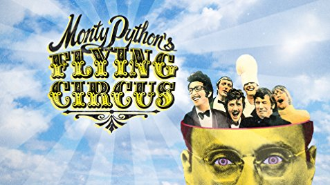

# Introducción a Python

## Trabajo previo

### Lecturas

Severance, D. C. R. (2016). *Python for Everybody: Exploring Data in Python 3* (S. Blumenberg & E. Hauser, Eds.). CreateSpace Independent Publishing Platform. [https://www.py4e.com/html3/](https://www.py4e.com/html3/)
\
\
Downey, Allen B. (2024). *Think Python: How to Think Like a Computer Scientist* (3rd ed.). O'Reilly Media. [https://greenteapress.com/wp/think-python-3rd-edition/](https://greenteapress.com/wp/think-python-3rd-edition/)

## Introducción

[Python](https://www.python.org/) es un lenguaje de programación de propósito general que ha alcanzado una gran popularidad en los últimos años. Fue declarado el lenguaje del año en 2024 por el índice [Tiobe](https://www.tiobe.com/tiobe-index/) de popularidad de lenguajes de programación, debido a su crecimiento en diversas áreas, entre las que destacan la ciencia de datos y el aprendizaje automático, además de desarrollo web, _scripting_ y visualización de datos, entre muchas otras.

Python también es ampliamente utilizado en enseñanza de la programación. En 2014, era el [lenguaje más empleado en cursos introductorios de programación de las principales universidades de Estados Unidos](https://cacm.acm.org/blogs/blog-cacm/176450-python-is-now-the-most-popular-introductory-teaching-language-at-top-u-s-universities/fulltext). Este uso en enseñanza se debe, entre otras razones, a que los programas en Python son más fáciles de leer y requieren menos líneas de código fuente que otros lenguajes de amplia difusión, tales como Java, C o C++.

## Historia

Python fue creado por el programador holandés [Guido van Rossum](https://gvanrossum.github.io/), quien concibió el diseño original del lenguaje a finales de la década de 1980 y dio a conocer la primera versión en 1991. El nombre del lenguaje es un homenaje al grupo de comedia británico [Monty Python](https://es.wikipedia.org/wiki/Monty_Python). [Según van Rossum](https://www.python.org/doc/essays/foreword/), en diciembre de 1989 buscaba un proyecto de programación como "pasatiempo" durante los días cercanos a la navidad, por lo que decidió escribir un interpretador para un lenguaje de programación en el que había estado pensando recientemente. Escogió el nombre Python por encontrarse en un "humor ligeramente irreverente" y ser un gran aficionado al programa de televisión ["El circo volador de Monty Python" (_Monty Python's Flying Circus_)](https://es.wikipedia.org/wiki/Monty_Python%27s_Flying_Circus) (figura 1).

<figure style="text-align: center;">
  
  <figcaption><strong>Figura 1</strong>. El circo volador de Monty Python. Fuente: <a href="https://www.imdb.com/title/tt0063929/">Internet Movie Database (IMDB)</a>.</figcaption>
</figure>

La "cultura" de Python ocasionalmente hace referencia a Monty Python en tutoriales, ejemplos y otros materiales. Por ejemplo, en el [uso de _spam_, _ham_ y _eggs_ como variables metasintéticas](https://en.wikipedia.org/wiki/Metasyntactic_variable) en sustitución de las tradicionales [_foo_, _bar_ y _baz_](https://en.wikipedia.org/wiki/Foobar), en alusión al _sketch_ [Spam](https://www.youtube.com/watch?v=_bW4vEo1F4E).

## Principales características

La filosofía de diseño de Python enfatiza la importancia de que los programas sean fáciles de leer, de manera que los programadores puedan entender rápidamente su propósito, control de flujo y funcionamiento. Esto facilita el mantenimiento de los programas existentes y disminuye la necesidad de crear otros nuevos.

Las siguientes son otras características importantes del lenguaje Python:

- Se distribuye con una licencia de código abierto llamada [Python Software Foundation License](https://es.wikipedia.org/wiki/Python_Software_Foundation_License).
- Es [interpretado](https://es.wikipedia.org/wiki/Int%C3%A9rprete_(inform%C3%A1tica)): las instrucciones se traducen una por una a [lenguaje de máquina](https://es.wikipedia.org/wiki/Lenguaje_de_m%C3%A1quina), a diferencia de los [lenguajes compilados](https://es.wikipedia.org/wiki/Compilador), que traducen de manera conjunta las instrucciones de una unidad completa (ej. un programa o una biblioteca). Los lenguajes interpretados tienden a ser más lentos que los compilados, pero también son más flexibles como entornos de desarrollo y depuración.
- Tiene un [sistema de tipos de datos dinámico](https://es.wikipedia.org/wiki/Tipado_din%C3%A1mico): las variables pueden tomar diferentes tipos de datos (ej. textuales, numéricos) durante la ejecución del programa, a diferencia de un [sistema de tipos de datos estático](https://es.wikipedia.org/wiki/Sistema_de_tipos#Tipado_est%C3%A1tico), en el que las variables solo pueden tener un tipo de datos durante la ejecución del programa. La mayoría de los lenguajes de tipos dinámicos son también lenguajes interpretados.
- Cuenta con [administración automática de memoria](https://en.wikipedia.org/wiki/Memory_management#Automated_memory_management): el interpretador se encarga de asignar y administrar la memoria de las variables, sin intervención del programador. Esto incluye un sistema de [recolección de basura](https://es.wikipedia.org/wiki/Recolector_de_basura), que libera la memoria de las variables que no están siendo utilizadas.
- Soporta varios [paradigmas de programación](https://es.wikipedia.org/wiki/Paradigma_de_programaci%C3%B3n): los paradigmas son estilos o enfoques teóricos de programación. En el caso de Python, incluye [programación orientada a objetos](https://es.wikipedia.org/wiki/Programaci%C3%B3n_orientada_a_objetos), [programación imperativa](https://es.wikipedia.org/wiki/Programaci%C3%B3n_imperativa), [programación funcional](https://es.wikipedia.org/wiki/Programaci%C3%B3n_funcional) y [programación procedimental](https://es.wikipedia.org/wiki/Programaci%C3%B3n_por_procedimientos).
- Es [multiplataforma](https://es.wikipedia.org/wiki/Multiplataforma): puede ejecutarse en los sistemas operativos más populares (ej. Windows, macOS, Linux).

## Principios de diseño

### El Zen de Python

La filosofía de diseño de Python está resumida en una lista de 19 principios conocida como el [Zen de Python](https://www.python.org/dev/peps/pep-0020/) que guían el uso del lenguaje.

### Guía de estilo para código Python

Los principios de diseño se reflejan en la [guía de estilo para código Python](https://www.python.org/dev/peps/pep-0008/), la cual proporciona una serie de convenciones para la escritura de programas.

### Programas "pitónicos"

La aplicación de estos principios y el seguimiento de mejores prácticas y de [_idioms_ de programación](https://en.wikipedia.org/wiki/Programming_idiom), como los descritos en [The Hitchhiker's Guide to Python!](https://docs.python-guide.org/), hacen que un programa se considere "pitónico" (_pythonic_). Los programadores que siguen la filosofía de Python son llamados [_pythonists_, _pythoneers_ o pythonistas](https://david.goodger.org/projects/pycon/2007/idiomatic/).

## Licenciamiento

[Python Software Foundation (PSF)](https://www.python.org/psf/) es la organización sin fines de lucro que posee los derechos de propiedad intelectual del lenguaje Python y que maneja las licencias de software libre con las que se distribuye. Su misión es _"promover, proteger y avanzar el lenguaje de programación Python, así como apoyar y facilitar el crecimiento de una comunidad diversa e internacional de programadores de Python"_.

La implementación de referencia del interpretador de Python, llamada [CPython](https://github.com/python/cpython), es software de [código abierto (_open source_)](https://es.wikipedia.org/wiki/C%C3%B3digo_abierto), lo que facilita que el desarrollo de Python sea conducido por una comunidad de programadores enlazada a través de Internet. Este modelo es seguido por la mayoría de las implementaciones del interpretador de Python. Una muestra muy representativa de este esquema de colaboración es el [Python Package Index (PyPI)](https://pypi.python.org), un repositorio para compartir componentes de software programados con Python, que a la fecha alberga más de medio millón de proyectos.

## Aplicación en datos geoespaciales

Python ha ganado una gran importancia en el área del desarrollo de aplicaciones geoespaciales debido a su popularidad, "suavidad" de la curva de aprendizaje y abundancia de recursos de educación y consulta (ej. tutoriales, libros, listas de correo, foros de discusión). Todas estas son características que, entre otras, lo hacen muy apropiado para programadores que no son especialistas en ciencias de la computación, como es el caso de muchos de los usuarios de [sistemas de información geográfica (SIG)](https://es.wikipedia.org/wiki/Sistema_de_informaci%C3%B3n_geogr%C3%A1fica) y otros tipos de software geoespacial. De hecho, muchas de estas herramientas han seleccionado a [Python como el lenguaje de preferencia para que sus usuarios amplíen o configuren la funcionalidad que ofrecen](https://www.mdpi.com/2220-9964/2/1/201). Como ejemplos, pueden mencionarse las bibliotecas [ArcPy](http://desktop.arcgis.com/en/arcmap/10.3/analyze/arcpy/what-is-arcpy-.htm) para [ArcGIS](https://www.arcgis.com/), [PyQGIS](https://docs.qgis.org/testing/en/docs/pyqgis_developer_cookbook/) para [QGIS](https://www.qgis.org/) y [PyGRASS](https://grass.osgeo.org/grass84/manuals/libpython/pygrass_index.html) para [GRASS GIS](https://grass.osgeo.org/) (figura 2).

<figure style="text-align: center;">
  
  <figcaption><strong>Figura 2</strong>. Uso de Python en software para manejo de datos geoespaciales. Fuente: (Zambelli et al., 2013).</figcaption>
</figure>

## Referencias bibliográficas

Zambelli, P., Gebbert, S., & Ciolli, M. (2013). PyGRASS: An object oriented Python application programming interface (API) for Geographic Resources Analysis Support System (GRASS) geographic information system (GIS). *ISPRS International Journal of Geo-Information, 2*(1), 201–219. https://www.mdpi.com/2220-9964/2/1/201
