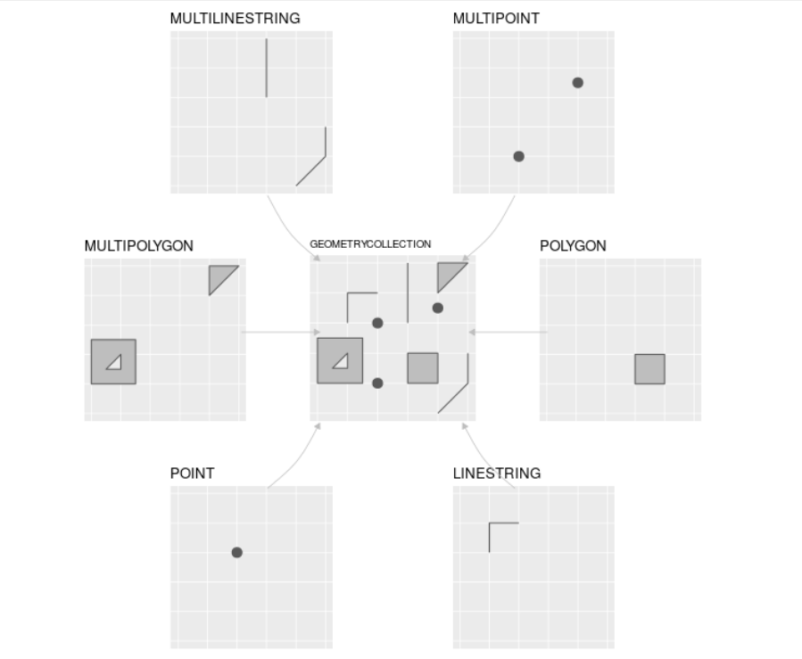
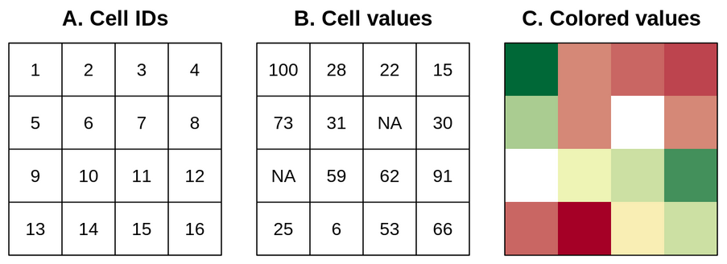
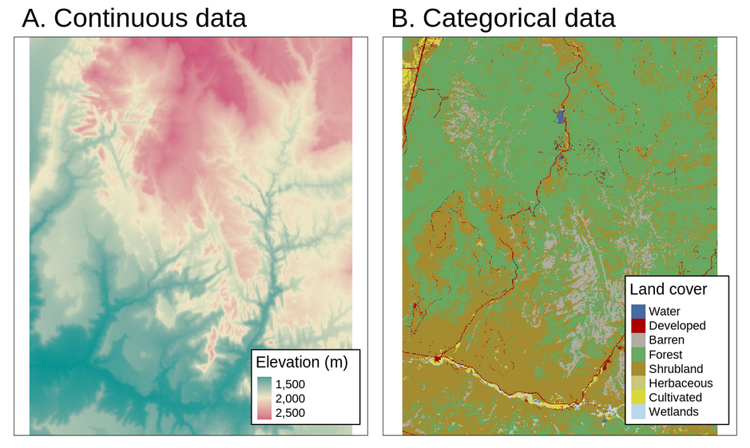

# Modelos y estándares de datos geoespaciales

## Trabajo previo

### Lecturas

Lovelace, R., Nowosad, J., & Münchow, J. (2019). *Geocomputation with R*. CRC Press. [https://geocompr.robinlovelace.net/](https://geocompr.robinlovelace.net/) (Capítulo 2)
\
\
Olaya, V. (2020). *Sistemas de Información Geográfica*. [https://volaya.github.io/libro-sig/](https://volaya.github.io/libro-sig/) (Parte 2, capítulo "Modelos para la información geográfica")

## Modelos de datos

Se utilizan dos modelos para la representación de datos geoespaciales: el vectorial y el raster.

### El modelo vectorial

El modelo vectorial de datos está basado en puntos localizados en un sistema de referencia de coordenadas (CRS; en inglés, *Coordinate Reference System*). Los puntos individuales pueden representar objetos independientes (ej. un poste eléctrico, una cabina telefónica) o pueden también agruparse para formar geometrías más complejas como líneas o polígonos. Por lo general, los puntos tienen solo dos dimensiones (x, y), a las que se les puede agregar una tercera dimensión _z_, usualmente correspondiente a la altitud sobre el nivel del mar.

#### El estándar Simple Features

[Simple Features](https://www.ogc.org/standards/sfa) (o Simple Feature Access) es un estándar abierto de la [Organización Internacional de Estandarización (ISO)](https://iso.org/) y del [Open Geospatial Consortium (OGC)](https://www.ogc.org/) que especifica un modelo común de almacenamiento y acceso para geometrías de dos dimensiones (líneas, polígonos, multilíneas, multipolígonos, etc.). El estándar es implementado por muchas bibliotecas y bases de datos geoespaciales como [GDAL](https://gdal.org/), [Fiona (Python)](http://github.com/Toblerity/Fiona), [Shapely (Python)](http://github.com/Toblerity/Shapely), [sf (R)](https://cran.r-project.org/web/packages/sf/index.html), [PostgreSQL/PostGIS](https://en.wikipedia.org/wiki/PostGIS), [SQLite/SpatiaLite](https://www.gaia-gis.it/fossil/libspatialite/), [Oracle Spatial](https://www.oracle.com/database/technologies/spatialandgraph.html) y [Microsoft SQL Server](https://www.microsoft.com/en-us/sql-server/), entre muchas otras.

La especificación define 18 tipos de geometrías, de las cuales siete son las más comúnmente utilizadas. Estas últimas se muestran en la figura 1.

<figure style="text-align: center;">
  
  <figcaption><strong>Figura 1</strong>. Tipos de geometrías de Simple Features más usadas. Fuente: (Lovelace et al., 2019).</figcaption>
</figure>

### El modelo raster

El modelo de datos raster usualmente consiste de un encabezado y de una matriz con celdas (también llamadas pixeles) de un mismo tamaño. El encabezado define el CRS, la extensión y el punto de origen de una capa raster. Por lo general, el origen se ubica en la esquina inferior izquierda o en la esquina superior izquierda de la matriz. La extensión se define mediante el número de filas, el número de columnas y el tamaño (resolución) de la celda.

Cada celda tiene una identificación (ID) y almacena un único valor, el cual puede ser numérico o categórico, como se muestra en la figura 2.

<figure style="text-align: center;">
  
  <figcaption><strong>Figura 2</strong>. El modelo raster: (A) ID de las celdas, (B) valores de las celdas, (C) mapa raster de colores. Fuente: (Lovelace et al., 2019).</figcaption>
</figure>

A diferencia del modelo vectorial, el modelo raster no necesita almacenar todas las coordenadas de cada geometría (i.e. las esquinas de las celdas), debido a que la ubicación de cada celda puede calcularse a partir de la información contenida en el encabezado. Esta simplicidad, en conjunto con el [álgebra de mapas](https://en.wikipedia.org/wiki/Map_algebra), permiten que el procesamiento de datos raster sea mucho más eficiente que el procesamiento de datos vectoriales. Por otra parte, el modelo vectorial es mucho más flexible en cuanto a las posibilidades de representación de geometrías y almacenamiento de valores, por medio de múltiples elementos de datos.

Los mapas raster generalmente almacenan fenómenos continuos como elevación, precipitación, temperatura, densidad de población y datos espectrales. También es posible representar mediante raster datos discretos, tales como tipos de suelo o clases de cobertura de la tierra, como se muestra en la figura 3.

<figure style="text-align: center;">
  
  <figcaption><strong>Figura 3</strong>. Ejemplos de mapas raster continuos y categóricos. Fuente: (Lovelace et al., 2019).</figcaption>
</figure>

## Referencias bibliográficas

Lovelace, R., Nowosad, J., & Münchow, J. (2019). *Geocomputation with R*. CRC Press. https://geocompr.robinlovelace.net/
